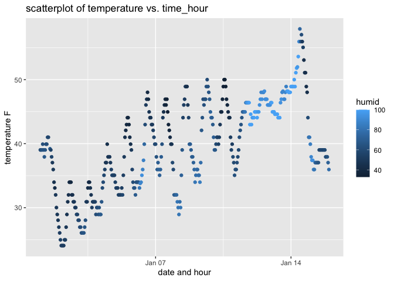

p8105_hw1_os2424
================
Ou Sha
2023-09-23

# Problem 1

``` r
library(moderndive)
data("early_january_weather")
# find names of variables in dataset
?early_january_weather
names(early_january_weather)
```

    ##  [1] "origin"     "year"       "month"      "day"        "hour"      
    ##  [6] "temp"       "dewp"       "humid"      "wind_dir"   "wind_speed"
    ## [11] "wind_gust"  "precip"     "pressure"   "visib"      "time_hour"

``` r
# find size of dataset
nrow(early_january_weather)
```

    ## [1] 358

``` r
ncol(early_january_weather)
```

    ## [1] 15

``` r
# find mean temp
mean(early_january_weather$temp)
```

    ## [1] 39.58212

There are 15 variables:  
1. origin: weather station;  
2. year, month, day, hour: time of recording;  
3. temp, dewp: temperature and dewpoint in F;  
4. humid: relative humidity;  
5. wind_dir, wind_speed, wind_gust: wind direction in degrees, spee and
gust speed in mph;  
6. precip: precipitation in inches;  
7. pressure: sea level pressure in millibars;  
8. visib: visibility in miles;  
9. time_hour: date and hour of the recording as a POSIXct date;  

The number of rows are 358, and the number of columns are 15.  
The mean temperature is 39.58212F.

``` r
# make scatter plot of temp vs. time_hour
ggplot(early_january_weather, aes(x = time_hour, y = temp, color = humid)) +
  geom_point() + labs(title = "scatterplot of temperature vs. time_hour",
                      x = "date and hour", y = "temperature F")
```

<!-- -->

Patterns that are apparent in this plot:  
Humidity tends to increase as temperature decreases. Temperature rises
during the daytime and drops at night.

``` r
ggsave("P1 Scatter plot.png", plot = last_plot())
```

    ## Saving 7 x 5 in image

# Probleam 2

``` r
# create a data frame
set.seed(5)
random_sample <- rnorm(10)
df <- tibble(vec_random = random_sample, 
       vec_logical = random_sample > 0,
       vec_character = letters[1:10],
       vec_factor = factor(sample(c(1, 2, 3), size = 10, replace = TRUE)))
df
```

    ## # A tibble: 10 × 4
    ##    vec_random vec_logical vec_character vec_factor
    ##         <dbl> <lgl>       <chr>         <fct>     
    ##  1    -0.841  FALSE       a             1         
    ##  2     1.38   TRUE        b             3         
    ##  3    -1.26   FALSE       c             1         
    ##  4     0.0701 TRUE        d             2         
    ##  5     1.71   TRUE        e             3         
    ##  6    -0.603  FALSE       f             2         
    ##  7    -0.472  FALSE       g             1         
    ##  8    -0.635  FALSE       h             2         
    ##  9    -0.286  FALSE       i             2         
    ## 10     0.138  TRUE        j             3

``` r
# take mean of random sample
mean(pull(df, vec_random))
```

    ## [1] -0.07885155

``` r
# take mean of logical vector
mean(pull(df, vec_logical))
```

    ## [1] 0.4

``` r
# take mean of character vector
mean(pull(df, vec_character))
```

    ## Warning in mean.default(pull(df, vec_character)): argument is not numeric or
    ## logical: returning NA

    ## [1] NA

``` r
# take mean of factor vector
mean(pull(df, vec_factor))
```

    ## Warning in mean.default(pull(df, vec_factor)): argument is not numeric or
    ## logical: returning NA

    ## [1] NA

Means can be calculated for random samples and logical vectors, but not
for character vectors and factor vectors.

``` r
# apply as.numeric function to logical, character, and factor variables
num_logic = as.numeric(pull(df, vec_logical))
num_character = as.numeric(pull(df, vec_character))
num_factor = as.numeric(pull(df, vec_factor))
```

Using `as.numeric` function change the type of certain variable to
numeric variables. For logical variables, True turns to 1 and False
turns to 0. For character variables, if the variables are not numbers
(e.g. letters), they cannot be converted to numeric variables and there
will be a warning when `as.numeric` applied. If the variables are
numbers, (e.g. “1”,“2”), they can be converted to numeric variables. For
factor variables, they can be converted to numeric variables
corresponding to the order of the level.  
This helps to explain why warning messages arise when `as.numeric` is
not used before applying the mean() function to calculate the mean of a
character or factor vector.
